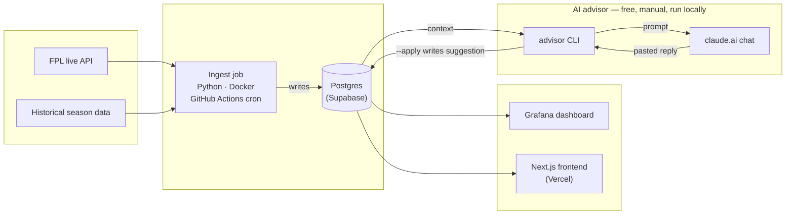

# Fantasy Premier League Pipeline

A data pipeline for Fantasy Premier League: ingest live FPL API data and historical
season data into Postgres, then consume it through a Grafana dashboard and an
LLM-based transfer/captaincy advisor.

## Architecture



The ingest job writes every live/historical fact to Postgres on its own
schedule. The advisor never calls a paid API — it only writes back when you
manually run `--apply` after pasting its prompt into a free claude.ai chat
(see [AI advisor](#ai-advisor) below). Everything else — the dashboard, the
frontend, the advisor's own context — only ever reads, so the advisor can
reason over real multi-season history instead of just the current gameweek
snapshot.

## Local development

Requires Docker and Python 3.11+.

```
cp .env.example .env
docker compose up -d
pip install -e ".[dev]"
```

`DATABASE_URL` in `.env` points at the local Docker Postgres by default. The
production ingest job (run via GitHub Actions) points at a hosted Supabase
Postgres instance instead, configured via repo secrets.

`docker compose up -d` also starts Grafana at http://localhost:3001
(login `admin` / `admin`, or whatever `GRAFANA_ADMIN_PASSWORD` is set to) with
an "FPL Overview" dashboard already provisioned — current rank, season points,
top scorers, and your current squad. It reads from the same local Postgres by
default; to point it at production Supabase instead, override the
`GRAFANA_POSTGRES_*` variables in `.env` with the session pooler
host/port/db/user/password and set `GRAFANA_POSTGRES_SSLMODE=require`.

## Production setup (Supabase + GitHub Actions)

The GitHub Actions workflow (`.github/workflows/ingest.yml`) needs two repo
secrets, set at Settings → Secrets and variables → Actions:

- `DATABASE_URL` — Supabase's **session pooler** connection string (Project
  Settings → Database → Connection string → Session pooler tab), of the form
  `postgresql://postgres.<ref>:<password>@aws-0-<region>.pooler.supabase.com:5432/postgres`.
  Use the pooler host, not the direct `db.<ref>.supabase.co` host — the direct
  host is IPv6-only and fails to resolve on many networks/runners.
- `FPL_TEAM_ID` — your FPL entry id.

The schema and historical backfill only need to be run once against a fresh
Supabase database (the scheduled job only handles the live/current-season
data from then on):

```
export DATABASE_URL="<supabase session pooler connection string>"
python -m fpl_pipeline.db.connection
python -m fpl_pipeline.ingest.historical
```

## Frontend (Next.js on Vercel)

A real web app (`web/`) that queries Supabase directly from the browser/server
(no Python backend involved) — a squad page with a live formation view, a
dashboard (rank/points history, top scorers), and a transfer-suggestions page.

This only works because Row Level Security is enabled on every table with a
public **read-only** policy for the `anon` role (see `schema.sql`) — the
frontend uses Supabase's anon/publishable key, which is meant to be public
and safe to embed in client code; it can only ever `SELECT`, never write.

### Local development

```
cd web
cp .env.local.example .env.local
```

Fill in `.env.local` with your Supabase project URL and anon/publishable key
(Project Settings → API):

```
npm install
npm run dev
```

Visit http://localhost:3000 (squad), http://localhost:3000/dashboard, and
http://localhost:3000/transfers (AI transfer suggestions — see below).

### Deploy to Vercel

1. Go to vercel.com → **New Project** → import this GitHub repo.
2. Set **Root Directory** to `web` (important — the Next.js app isn't at the repo root).
3. Add two environment variables (from the same Supabase API settings page):
   - `NEXT_PUBLIC_SUPABASE_URL`
   - `NEXT_PUBLIC_SUPABASE_ANON_KEY`
4. Deploy. Every push to `main` auto-deploys; every page load fetches fresh
   data straight from Supabase, so there's nothing to keep "in sync" — no
   ingest job dependency, no rebuild needed when the data changes.

## AI advisor

Builds a prompt from your current squad, each player's last-5-gameweek form,
next-3 fixture difficulty, your budget, and in-form alternatives at each
position (all pulled from Postgres):

```
python -m fpl_pipeline.advisor
```

This prints a prompt for you to paste into a free chat at claude.ai — no
API costs, ever. The advisor accounts for how many free transfers you
currently have banked (computed from your transfer history — free
transfers roll over, capped at 5) and only recommends a transfer beyond
that allowance when the expected point gain over the next few gameweeks
clearly outweighs the 4-point hit.

### Transfers tab (`web/transfers`)

The prompt also asks claude.ai to end its reply with a machine-readable
` ```json ` block. Save that reply to a file and run:

```
python -m fpl_pipeline.advisor --apply <file>
```

which parses the JSON block and writes it to the `advisor_suggestions`
table, which the frontend's Transfers tab reads and renders. This is a
manual, on-demand step — nothing calls the Claude API, so it costs
nothing and there's no extra repo secret to configure. Re-run it whenever
you want an updated suggestion (typically once a gameweek, after your
squad's picked up its latest results).
